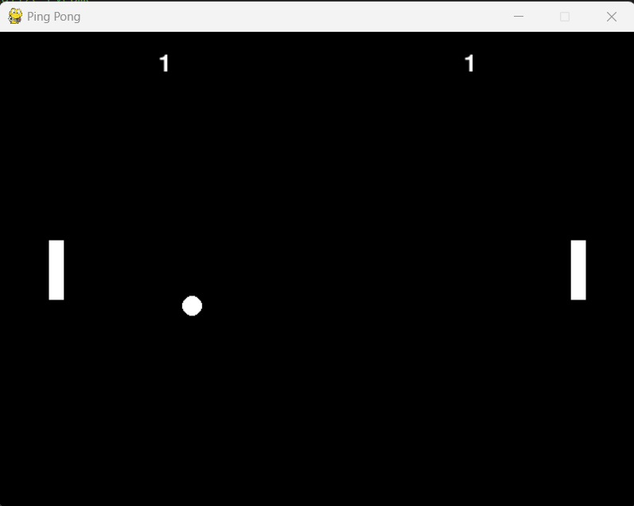

# Simple Ping Pong Game with Pygame

This is a simple implementation of a ping pong game using the Pygame library in Python.

## Getting Started

### Prerequisites

Make sure you have Python and Pygame installed on your machine.

```bash
pip install pygame
```

## Running the Game
Run the `main.py` or `v2.py` script to start the game.

```cmd
python ping_pong.py
```



## Controls
- **Left Paddle:**
    - Move Up: W
    - Move Down: S

- **Right Paddle:**
    - Move Up: Up Arrow
    - Move Down: Down Arrow

## Game Rules
- The game starts with both paddles at the center and a ball moving between them.
- Use the paddle controls to hit the ball and prevent it from passing your paddle.
- Score points when the ball passes the opponent's paddle.
- The game continues until one player reaches a score of 5.
- The scores are displayed at the top of the screen.
- The game restarts after a 2-second pause when one player wins.

## References
- https://www.youtube.com/watch?v=HNCAi0sjAz8 - NeuralNine Tutorial on PONG game using pygame